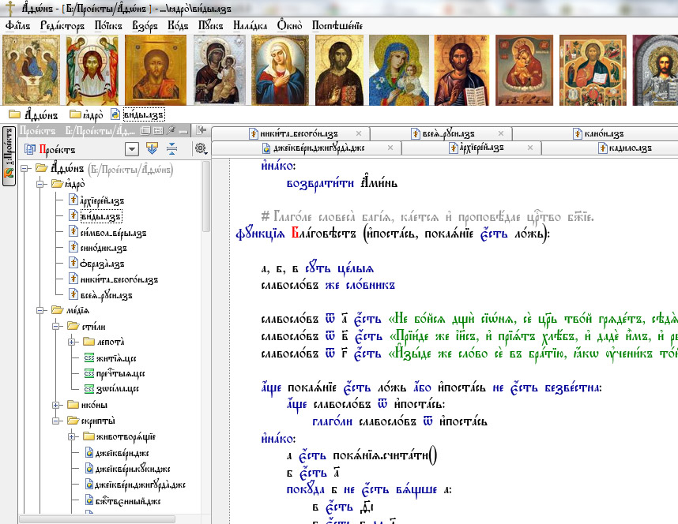

# СвятОС

Операционная система с оформлением религиозной тематики. Вдохновлено этим:

Что мы видим на картинке? Какой план действий?

* Криво прифотошоплена иконка к окну - можно похукать и отрисовать как здесь
* Иконы на тулбаре имеют разную ширину - можно попробовать запатчить размер отображаемых кнопок
* Слева слово "Проектъ" имеет красную букву "П" - попробовать захукать отрисовку и перерисовывать первый глиф красным
* Отломать все родные шрифты в винде, системный FixedSys запатчить и сделать с глаголицей (из скриншота)
* Попробовать отломать все раскладки и таблицы символов, оставив только глаголицу
* Удалить из шрифтов латинские буквы, заменив их кириллическими
